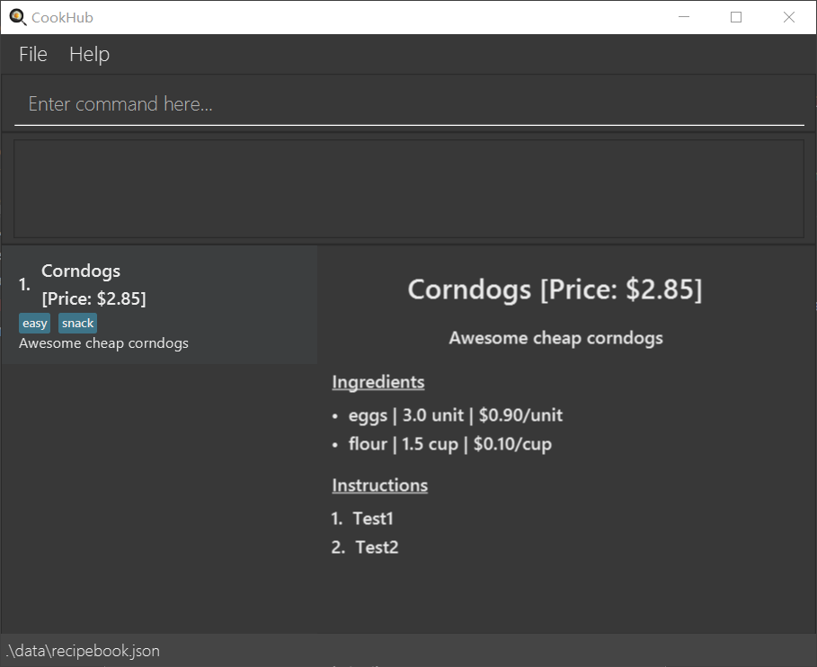

CookHub is a **desktop app for managing recipes, optimized for use via a Command Line Interface** (CLI) while still having the benefits of a Graphical User Interface (GUI). This recipe tracking app is targeted for student chefs on a tight budget and schedule with limited ingredients. 

* Table of Contents
{:toc}

--------------------------------------------------------------------------------------------------------------------

## Quick start

1. Ensure you have Java `11` or above installed in your Computer.

1. Download the latest `cookhub.jar` from [here](https://github.com/AY2223S2-CS2103T-W09-1/tp/releases).

1. Copy the file to the folder you want to use as the _home folder_ for your CookHub.

1. Open a command terminal, `cd` into the folder you put the jar file in, and use the `java -jar cookhub.jar` command to run the application. 
   A GUI similar to the below should appear in a few seconds. Note how the app contains some sample data. 
   

1. Type the command in the command box and press Enter to execute it. e.g. typing **`help`** and pressing Enter will open the help window. 
   Some example commands you can try:

   * `add` n/NAME` : Add a new recipe.
   * `delete` : Delete a new recipe.
   * `list` : Lists all recipes.
   * `view {recipe no.}` : View a recipe in greater detail.

1. Refer to the [Features](#features) below for details of each command.

--------------------------------------------------------------------------------------------------------------------

## Features

**:information_source: Notes about the command format:** 

* Words in `UPPER_CASE` are the parameters to be supplied by the user. 
  e.g.

* Items in square brackets are optional. 
  e.g 

* Items with `…`​ after them can be used multiple times including zero times. 
  e.g. 

* Parameters can be in any order. 
  e.g. 

* If a parameter is expected only once in the command but you specified it multiple times, only the last occurrence of the parameter will be taken. 
  e.g. 

* Extraneous parameters for commands that do not take in parameters (such as `help`, `list`, `exit` and `clear`) will be ignored. 
  e.g. 

### Viewing help : `help`

Shows a message explaining how to access the help page.

Format: `help`

### Add a recipe : `add`

Adds a recipe to the recipe book.

Format: `add t/TITLE d/DESCRIPTION i/INGREDIENT s/STEP [t/TAG]`

:bulb: Tip: A recipe can have any number of tags (including 0)

Examples:

- `add t/Corndogs d/I love corndogs i/100g flour i/500ml oil i/Half block of string cheese i/100ml water 
  i/Hotdog s/Mix flour and water until homogenous s/Poke hotdog and string cheese through a skewer s/Dip skewer into batter until fully coated s/Fry in oil until golden brown`
- `add t/Scrambled Eggs i/4 eggs i/1 tablespoon of butter i/100ml heavy cream s/Crack the eggs into a bowl, add the cream and whisk s/Heat the butter in the pan until sizzling s/Pour the eggs in and stir until cooked to desired doneness tag/easy tag/15min`

### Edit a recipe: `edit {recipe number}`
Edits a recipe in the recipe book.

Format: `edit {recipe number} t/TITLE d/DESCRIPTION i/INGREDIENT s/STEP [t/TAG]`

- The *recipe number* refers to the index number shown in the displayed recipe book
- The *recipe number* must be a positive integer starting from 1 and must exist in the recipe book

Example:
- `edit 1 t/Corndogs d/I love corndogs i/200g flour i/500ml oil i/half block string cheese i/100ml water 
i/Hotdog s/Mix flour and water until homogenous s/Poke hotdog and string cheese through a skewer s/Dip skewer into batter until fully coated i/Fry in oil until golden brown`

### Delete a recipe : `delete {recipe no.}`
Deletes the recipe at the specified *task number* from the recipe book.

Format: `delete {recipe number}`

- The *recipe number* refers to the index number shown in the displayed recipe book
- The *recipe number* must be a positive integer starting from 1 and must exist in the recipe book

Examples:
- `delete 1`
- `delete 2`

### List recipe : `list`

Lists out all the recipes that you have added to CookHub

Format: `list`

Example: list
Expected outcome:

Here are all your recipes in CookHub:
1. Lasagna
2. Risotto
3. Kimchi Soup

---

### Saving the data

CookHub data are saved in the hard disk automatically after any command that changes the data. There is no need to save manually.

### Editing the data file

CookHub data are saved as a JSON file `[JAR file location]/data/cookhub.json`. Advanced users are welcome to 
update data directly by editing that data file.

:exclamation: **Caution:**
If your changes to the data file makes its format invalid, CookHub will discard all data and start with an empty data file at the next run.

### Archiving data files `[coming in v2.0]`

_Details coming soon ..._

--------------------------------------------------------------------------------------------------------------------

## FAQ

**Q**: How do I transfer my data to another Computer? 
**A**: Install the app in the other computer and overwrite the empty data file it creates with the file that contains the data of your previous CookHub home folder.

--------------------------------------------------------------------------------------------------------------------

## Command summary

Action | Format, Examples
------|------------------
